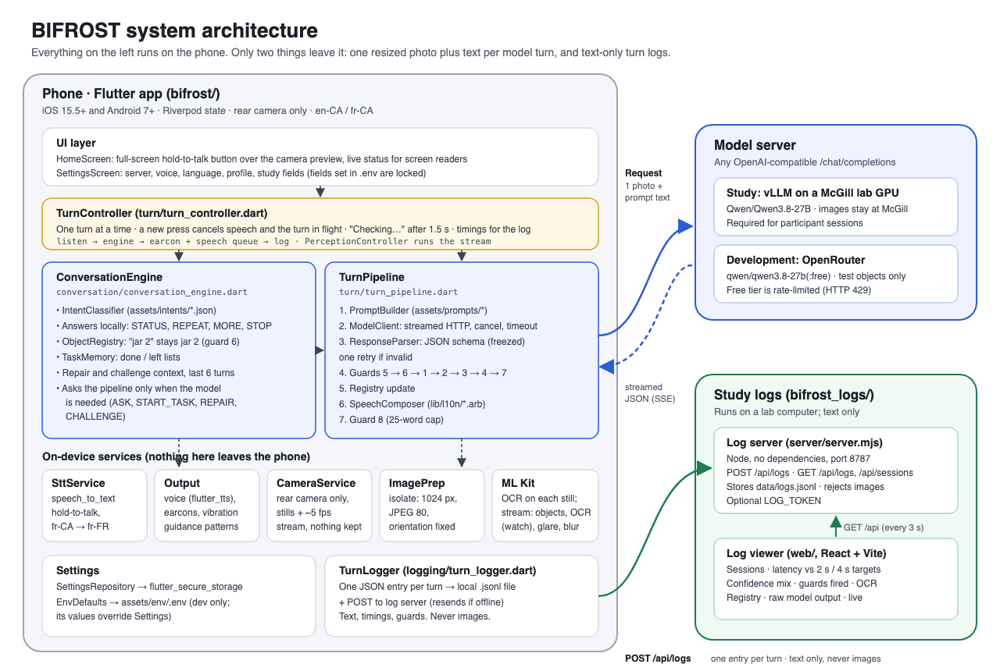
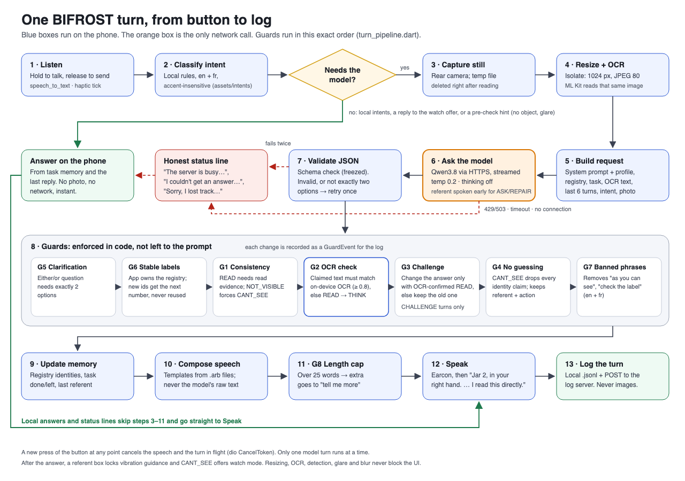

# BIFROST architecture

This document explains how BIFROST is built: what runs where, how one spoken question becomes one spoken answer, where each behaviour rule is enforced, and what is still missing. It describes the code as of 5 October 2026. Phases 1–4 are built; turn logging was built ahead of Phase 5.

When this document says "Section N", it means a section of the team's project specification.

---

## 1. The system at a glance



*Full-size vector version: [`docs/architecture-overview.svg`](docs/architecture-overview.svg)*

BIFROST has three parts:

| Part | Folder | Runs on | Job |
|---|---|---|---|
| **Mobile app** | this repository | The participant's phone (iOS or Android) | Listens, takes a photo, reads text on the phone, asks the model, checks the answer, and speaks it |
| **Model server** | (not in this repo) | A McGill lab GPU (study) or OpenRouter (development) | Runs the Qwen3.8 vision-language model behind an OpenAI-compatible API |
| **Log server and viewer** | `bifrost_logs` (separate project) | A lab computer | Collects one text log entry per turn and shows the logs to researchers |

### Design principle: the app is in charge, not the model

Our observations (O1–O6) show that current AI assistants guess, change their answers under pressure, and never say which object they mean. If we only *ask* the model to behave, it won't do so reliably. So in BIFROST:

- the model is used only to **look at one photo and fill in a fixed JSON form**;
- the app **decides** what the user meant, which object is "jar 2", whether the model's claims are backed by evidence, and what exactly gets said;
- every spoken sentence is built from **our own templates**. The model's free text is never read out as a whole.

### What leaves the phone

There are only two outgoing connections:

1. **To the model server, once per model turn:** one photo (resized to 1024 px, JPEG quality 80), the text context, and the user's words.
2. **To the log server, once per turn:** a text-only log entry. Images are never logged, and the server rejects any entry that contains one.

Everything else stays on the phone: speech recognition, OCR, object detection on the live camera stream, glare and blur checks, vibration guidance, watch mode, intent classification, the object registry, task memory, the guards, earcons and speech output.

---

## 2. The life of one turn



*Vector version: [`docs/turn-pipeline.svg`](docs/turn-pipeline.svg)*

The numbers match the diagram.

1. **Listen.** The user holds the full-screen button and speaks. With VoiceOver or TalkBack, double tap starts and double tap again sends. `SttService` uses the language from Settings (en-CA or fr-CA) and falls back to the closest locale the phone has, such as fr-FR.
2. **Classify the intent.** `IntentClassifier` matches the words against the phrase lists in `assets/intents/en.json` and `fr.json`, ignoring case, accents and punctuation. The result is one of `START_TASK`, `ASK`, `CHALLENGE`, `REPAIR`, `STATUS`, `WATCH`, `MORE`, `REPEAT` or `STOP`, plus details such as the task type ("sort", "find", "match"), the goal ("keys"), an item number ("item 3") or a direction ("the closer one").
   - **Local intents never reach the model.** `STATUS` reads the task memory, `REPEAT` repeats the last reply, `MORE` speaks the detail held back from the last answer, `STOP` cancels everything, and `WATCH` starts watch mode. These answers are instant and work offline.
   - **Pre-check.** For `ASK`, `CHALLENGE` and `REPAIR`, the app first looks at the live camera stream. If no object is detected it says "Nothing in view. Sweep slowly." and starts vibration guidance; if there is glare on the target it says "Glare. Tilt it away from the light." In both cases the model isn't called. `START_TASK` and search tasks skip this, because they need the whole scene.
3. **Capture a still** with the rear camera. The camera plugin writes a temporary file, which is deleted as soon as it has been read.
4. **Resize and run OCR.** In a background isolate, the still is rotated upright and resized to a 1024 px long side. ML Kit then reads text from **that same resized image**, so OCR and the model see exactly the same pixels.
5. **Build the request.** `PromptBuilder` combines:
   - the system prompt for the current language (`assets/prompts/system_{en,fr}.txt`), with the position style and vision profile filled in;
   - the JSON schema;
   - the `OBJECT_REGISTRY`, `TASK_STATE`, the last six turns as text, the `INTENT` and the `OCR_TEXT`;
   - for repairs and challenges, the extra context (`CHOSEN_REFERENT`, `CLARIFICATION_OPTIONS`, `PREVIOUS_ANSWER`);
   - the photo.
6. **Ask the model.** `OpenAiCompatibleClient` sends one streamed HTTPS request to `/chat/completions` with temperature 0.2 and thinking turned off. If the server is busy (HTTP 429/503), the app waits 2 s and retries once. If nothing has been said 1.5 s after the button was released, the app says "Checking…". The whole turn has a hard timeout (`TIMEOUT_S`). A new button press cancels the request at once.
   While the reply streams in, a tolerant partial parser (`EarlyReferentReader`) watches for the `referent`. For `ASK` and `REPAIR` (never `CHALLENGE`), when no clarification is needed and the object is known or has a location, the referent is spoken right away ("Jar 4, in your right hand…"), before the rest arrives. If the guards later change the referent, the rest starts with "Correction:".
7. **Validate the JSON.** `ResponseParser` checks the reply against the schema (freezed / json_serializable models). If the JSON is invalid, or a clarification doesn't have exactly two options, the app retries once with a corrective instruction. If it fails twice, the user hears "Sorry, I lost track. Ask again."
8. **Apply the guards**, in a fixed order (Section 4 below).
9. **Update memory.** The registry records what each object was identified as and with what confidence. The task's done and left lists, and the "last object talked about", are updated.
10. **Compose speech** from the localized templates in `lib/l10n/app_{en,fr}.arb`: `{referent}. {observation} {confidence phrase} {next step}`.
11. **Guard 8 (length cap).** If the reply is over 25 words, the extra part is held back for "tell me more".
12. **Speak.** The confidence earcon plays first (READ: bright rising, THINK: single tone, CAN'T SEE: low falling, clarification: two equal tones, error: low buzz), then the speech. Everything goes through one speech queue, so "Checking…", the early referent, the earcon and the answer never overlap. The user can interrupt at any time.
    - **After the answer:** if the reply has a referent box, vibration guidance locks onto the matching tracked object (Section 3.5). After a CAN'T SEE answer, the app asks "Want me to tell you when I can read it?"; "yes" starts watch mode.
13. **Log the turn** with `TurnLogger`, to a local file and to the log server.

**Errors are spoken honestly (rule 12).** A rate limit (HTTP 429/503) gives "The server is busy. Try again in a moment." A timeout gives "I couldn't get an answer. Try again." No connection gives "I can't connect to the server." The status line on screen is a screen-reader live region, so status changes are also announced.

**Only one turn runs at a time.** Pressing the button again at any point stops the current speech and cancels the turn in flight (dio `CancelToken`). Late results from a cancelled turn are discarded.

---

## 3. Inside the mobile app

### 3.1 Code layout (`lib/src/`)

| Folder | Main classes | Responsibility |
|---|---|---|
| `ui/` | `HomeScreen`, `SettingsScreen`, `OnboardingScreen`, `LearnVibrationsScreen`, `LearnSoundsScreen` | Hold-to-talk screen, settings, spoken first-run setup, vibration and sound lessons |
| `turn/` | `TurnController`, `TurnPipeline` | Runs a turn on the device (controller); turns a request into a guarded, composed reply (pipeline) |
| `conversation/` | `ConversationEngine`, `ObjectRegistry`, `TaskMemory` | Conversation state across turns, local answers, repair and challenge context |
| `intent/` | `IntentClassifier` | Rule-based intent detection from JSON phrase lists |
| `model/` | `PromptBuilder`, `OpenAiCompatibleClient`, `ResponseParser`, `VlmResponse` | Request building, streaming HTTP, schema validation |
| `guards/` | `Guards`, `BannedPhrases` | The app-side guards, as small pure functions |
| `speech/` | `SttService`, `TtsService`, `SpeechComposer`, `SpokenReply`, `LocalePicker` | Speech in and out, template-based wording |
| `vision/` | `CameraService`, `ImagePrep`, `OcrService`, `StreamAnalyzer`, `LumaGrid`/`LumaMetrics`, `SceneMonitor`, `NormBox` | Camera stills and stream, resizing, ML Kit OCR and object detection, glare and blur, box geometry |
| `perception/` | `PerceptionController` | Connects the camera stream to guidance, glare/blur hints and watch mode |
| `guidance/` | `GuidanceController`, `TargetTracker`, `GuidancePattern`, `HapticPlayer` | Pure-Dart vibration guidance and target locking; device vibration with a HapticFeedback fallback |
| `watch/` | `WatchController` | "Tell me when you can read it" |
| `audio/` | `Earcon`, `EarconPlayer` | The seven earcons (`assets/sounds/`, generated by `tool/make_earcons.py`) |
| `settings/` | `AppSettings`, `SettingsRepository`, `EnvDefaults` | Settings model, secure storage, development `.env` |
| `logging/` | `TurnLogger`, `TurnTimes` | Turn log entries, local file and upload |
| `text/` | `TextNormalize` | Accent-insensitive matching, Levenshtein similarity |

### 3.2 Layers and dependencies

```
UI (widgets)
  └─ TurnController            device glue: STT, camera, TTS, timers, logging
       └─ ConversationEngine   pure Dart: intents, registry, task memory
            └─ TurnPipeline    pure Dart: prompt → model → validate → guards → compose
                 └─ ModelClient (interface)  ← OpenAiCompatibleClient (dio)
```

- **The core is pure Dart.** `ConversationEngine` and `TurnPipeline` don't use the camera, microphone or speaker. The camera reaches them as a `capture()` function, and the model as a `ModelClient` interface. This is why the whole conversation, including the Section 16 script, can be tested on recorded fixtures without a phone.
- **State management uses Riverpod.** Providers create the services (camera, speech, OCR, logger) and the long-lived `ConversationEngine`. `TurnController` is a `Notifier` that exposes `TurnState` (status, last transcript, last reply) to the UI.
- **Heavy work stays off the UI thread.** Image resizing runs in an isolate (`Isolate.run`). Network I/O is non-blocking, so the UI never freezes.

### 3.3 Conversation state

`ConversationState` (owned by `ConversationEngine`) holds:

| Field | Meaning |
|---|---|
| `registry` | Every object labelled in this task: id, label ("jar 2"), description, location, what it was identified as, the text read, and the confidence |
| `task` | Task type and goal from `START_TASK` |
| `history` | Past turns as text; the last 6 are sent to the model |
| `lastSpoken`, `lastDetail` | Used for `REPEAT` and `MORE` |
| `pendingClarification` | The two options of the either/or question just asked, used to resolve "the closer one" |
| `lastReferentId` | The object the last answer was about, used for `CHALLENGE` and "the other one" |

**Registry ownership (guard 6).** The model proposes ids such as `jar_4`. The app maps every unknown id to the next sequential number and keeps that mapping, so "jar 2" stays jar 2 for the whole task and a number is never reused. Each turn works on a **copy** of the registry, which is kept only if the turn succeeds.

**Done and left.** An object counts as *done* when it has been identified from text BIFROST actually read (`READ`, confirmed by OCR). Everything else is *left*.

### 3.4 Repair and challenge

- **REPAIR.** "item 3" picks object 3 from the registry directly. "the closer one" or "the left one" is matched against the two clarification options using direction words from the intent file. If one option matches, it is sent as `CHOSEN_REFERENT` and the prompt tells the model to answer without asking again. "the other one" with no pending question sends the previous object, so the model can choose a different one.
- **CHALLENGE.** The previous answer about the object is sent as `PREVIOUS_ANSWER`. Guard 3 then decides whether a changed answer is allowed (Section 4).

### 3.5 Perception: the live camera stream

`StreamAnalyzer` takes about 5 preview frames per second from the rear camera (NV21 on Android, BGRA on iOS) and drops any frame that arrives while the previous one is still being processed.

- **Object detection.** ML Kit, stream mode, multiple objects, tracking on. Boxes are converted to upright 0–1 coordinates following the official ML Kit example, so image left is the user's left.
- **Glare and blur.** The frame is sampled into a small brightness grid; a background isolate measures the fraction of saturated pixels in the target box (glare) and the Laplacian variance (blur).
- **OCR on the stream.** Runs only during watch mode, about 4 per second.

`PerceptionController` feeds these results to four pure-Dart deciders, each unit-tested without a phone:

| Decider | Job |
|---|---|
| `SceneMonitor` | Turns frames into once-per-event warnings: glare above 15 %, or blur for 1 s ("Hold it still.") |
| `TargetTracker` | Default target = largest object nearest the centre. After an answer with `referent.bbox`, locks onto the tracked object with IoU ≥ 0.3, until the next question, STOP, or 3 s unseen |
| `GuidanceController` | Direction as rhythm: left = one long pulse, right = two short, up = three taps, down = two long, full view = one strong buzz. Repeats every 1.2 / 0.7 / 0.4 s as the target gets closer, with 300 ms hysteresis, a dead zone at switch points, no overlapping beats and a single full-view buzz. "Nothing in view" is spoken once, never vibrated. |
| `WatchController` | Pulses every 2 s; triggers when the same 3+ letter words appear in two consecutive frames, then asks the model again as `ASK`; gives up after 20 s with "I still can't read it…" |

Vibration stops while a model call runs or speech plays (except in search tasks, if "vibrate in search tasks" is on) and when the app goes to the background. `HapticPlayer` uses custom patterns where the phone supports them and falls back to built-in HapticFeedback impacts otherwise. All thresholds are editable in Settings → Developer, and are logged with every turn.

### 3.6 Onboarding, profiles and earcons

- **Spoken onboarding** on first run (about a minute, fully screen-reader accessible): language, blind or low vision, position style (clock face or left/right), speech rate with a preview, earcons on/off, vibration guidance on/off with an optional "Learn the vibrations", then a three-step practice (hold to talk, hear an earcon, ask "what is this?"). It can be redone from Settings.
- **Low-vision profile:** besides its prompt block, it switches the app to a high-contrast, large-text theme (yellow on black, text 1.4×).
- **Learn the vibrations:** plays each pattern with its meaning, then a practice where a random pattern plays and the user answers by voice or button; four correct in a row means ready. Accuracy is logged.
- **Learn the sounds:** plays each earcon with its meaning.

---

## 4. Where each behaviour rule is enforced

The rules in Section 3 of the specification are enforced in code wherever possible, with the prompt as a second layer.

| # | Rule | Enforced by |
|---|---|---|
| 1 | Referent first | `SpeechComposer` always starts with the referent. Whole-scene answers start with "Overall view." |
| 2 | Persistent labels | `ObjectRegistry` (guard 6) |
| 3 | Ask, don't guess | Prompt rule 1, guard 5, and a clarification template that asks one either/or question |
| 4 | Three confidence levels | Guards 1 and 2 decide the level; the composer always speaks a confidence phrase |
| 5 | No general-knowledge fill-in | Prompt rule 5, and guard 4 for `CANT_SEE`. *Partial: free text in a THINK answer isn't checked.* |
| 6 | Hold when challenged | Guard 3 |
| 7 | One-phrase repair | `REPAIR` intent, number lookup and option matching |
| 8 | Task memory | `TaskMemory`, with `STATUS` answered locally |
| 9 | Brevity (25 words) | Prompt asks for an observation of at most 12 words; guard 8 enforces 25 words; guard 7 removes chatter |
| 10 | Never assume sight | Guard 7 and the prompt |
| 11 | Usable positions | Prompt position blocks (clock face or left/right, chosen in onboarding) and vibration guidance toward the target |
| 12 | Honest system status | Spoken failure lines, the error earcon, "Checking…", "Nothing in view", glare and blur hints, and live-region status announcements |

### The guards, in execution order

All guards are small pure functions in `guards/guards.dart`. Each change is recorded as a `GuardEvent` (guard name, before, after) and written to the turn log.

| Order | Guard | What it does |
|---|---|---|
| (step 7) | **G5 Clarification validity** | A clarification with other than exactly two options triggers one retry. After that, extra options are cut to two; if there are fewer than two, the turn fails honestly. |
| 1 | **G6 Label stability** | Rewrites the model's ids and labels to the registry's own |
| 2 | **G1 Confidence consistency** | `READ` without read evidence becomes `THINK`; `NOT_VISIBLE` forces `CANT_SEE` |
| 3 | **G2 OCR cross-check** | A `READ` claim must match on-device OCR: every word found, or similarity ≥ 0.8. Otherwise it becomes `THINK`, "the label is hard to read". This blocks invented labels. |
| 4 | **G3 Challenge** (CHALLENGE turns only) | A changed answer is accepted only if it is now an OCR-confirmed `READ` ("Now I read PAPRIKA. I was wrong before."). Otherwise the previous answer is restored ("I still read CUMIN on this one."). |
| 5 | **G4 No guess-filling** | A `CANT_SEE` answer loses every identity claim; only the referent, "I can't see…" and the physical action remain |
| 6 | **G7 Banned phrases** | Removes sight-assuming phrases ("as you can see", "check the label", and the French equivalents) and filler sentences ("Let me know if…", "N'hésite pas…") from all model text |
| (step 11) | **G8 Length cap** | Over 25 words, the reply is shortened in steps, and everything removed goes to "tell me more": (1) the next step moves out, except the physical action of a `THINK` or `CANT_SEE` answer; (2) the observation keeps only its first sentence; (3) a long sentence is cut at its last clause boundary that fits. The referent and confidence phrase are always kept. |

---

## 5. The model contract

**Request.** This is a standard OpenAI-compatible chat completion, so the same app works with vLLM, OpenRouter or any compatible server:

```json
{
  "model": "Qwen/Qwen3.8-27B",
  "temperature": 0.2,
  "stream": true,
  "response_format": {"type": "json_object"},
  "chat_template_kwargs": {"enable_thinking": false},
  "messages": [
    {"role": "system", "content": "<system prompt + profile + schema>"},
    {"role": "user", "content": [
      {"type": "text", "text": "OBJECT_REGISTRY: …\nTASK_STATE: …\nRECENT_TURNS: …\nINTENT: ASK\nOCR_TEXT: …\nUSER_SAID: What's this?"},
      {"type": "image_url", "image_url": {"url": "data:image/jpeg;base64,…"}}
    ]}
  ]
}
```

With reasoning set to `off`, thinking is disabled for both vLLM (`chat_template_kwargs`) and OpenRouter (`reasoning.enabled: false`). Each server ignores the other's field.

**Response.** The model must return the JSON schema from Section 8 of the specification:

```json
{
  "needs_clarification": false,
  "clarification_options": [],
  "referent": {"id": "jar_4", "label": "jar 4", "short_description": "…", "location": "in your right hand", "bbox": [0.42, 0.35, 0.18, 0.30]},
  "evidence": "READ",
  "read_text": "PAPRIKA",
  "confidence": "THINK",
  "confidence_reason": "your thumb covers part of the label",
  "observation": "The label says paprika.",
  "next_step": "Move your thumb and I'll confirm.",
  "detail": "",
  "answer_changed": false,
  "registry_updates": [ … ]
}
```

Field order matters for the streaming planned in Phase 4, where the referent will be spoken before the rest arrives. For now, the full reply is collected before validation.

---

## 6. Configuration and editable content

### 6.1 Settings

| Setting | Stored in | Notes |
|---|---|---|
| Model base URL, model name, API key, reasoning, timeout | `flutter_secure_storage` | No secrets in source code |
| Language, speech rate, vision profile, position style | `flutter_secure_storage` | Profile and position style change the prompt |
| Log server URL, log token, participant code | `flutter_secure_storage` | |
| **Development overrides** | `assets/env/.env` (git-ignored) | Any value set here **overrides** Settings, and the field shows as locked. The file is bundled into the app, so builds made with a key in it must not be shared. Participant builds must be made without it. |

### 6.2 Wording the team can change without touching code

| What | Where |
|---|---|
| System prompts, profile and position blocks, schema, retry instructions | `assets/prompts/` |
| Intent phrases and direction words (en, fr) | `assets/intents/{en,fr}.json` |
| Banned sight-assuming phrases | `assets/guards/banned_phrases.json` |
| Every spoken template, status line and UI string (en, fr) | `lib/l10n/app_{en,fr}.arb`; run `flutter gen-l10n` afterwards |

### 6.3 Languages

The UI, templates, intents and prompts all exist in English and Canadian French. Speech-to-text, text-to-speech and the prompt's `{LANGUAGE}` follow the language setting. Text read from a label (`read_text`) stays in the label's own language. Label text in capitals ("CUMIN") is spoken as "Cumin" so the voice doesn't spell it out letter by letter.

---

## 7. Logging and the log viewer (`bifrost_logs`, a separate project)

### 7.1 Turn log entry

`TurnLogger` writes one JSON object per turn, following Section 13 of the specification:

| Group | Fields |
|---|---|
| Who and what | `session_id`, `participant`, `mode`, `language`, `profile`, `task`, `turn_index` |
| What was said | `transcript`, `intent`, `intent_slots`, `spoken_text`, `detail` |
| Timing | `timestamps` (release, first audio, full answer, speech end), `latency_ms` |
| Model | `used_model`, `failure`, `raw_model` (every attempt), `response` (after the guards) |
| Evidence | `confidence`, `clarification`, `challenge`, `ocr_tokens`, `guards` (before → after) |
| Memory | `registry` (a snapshot after the turn) |

Each entry is written to `Documents/bifrost_logs/<session>.jsonl` on the phone and sent to the log server. If the upload fails, up to 200 entries are kept and resent with the next turn.

### 7.2 Log server (`bifrost_logs/server/server.mjs`)

This is a plain Node server with no dependencies.

| Endpoint | Purpose |
|---|---|
| `POST /api/logs` | Store one entry or an array of entries. Requires `session_id`; rejects images. Optional bearer token (`LOG_TOKEN`). |
| `GET /api/logs?session=…&limit=…` | Read entries |
| `GET /api/sessions` | One summary row per session |
| `GET /api/health` | Liveness check |
| `GET /` | Serves the built viewer |

Entries are appended to `server/data/logs.jsonl`.

### 7.3 Log viewer (`bifrost_logs/web/`, React + Vite)

The viewer shows:
- a list of sessions;
- summary cards: turn count, median time to first audio (target ≤ 2 s) and to full answer (target ≤ 4 s), the READ/THINK/CAN'T SEE mix, guard counts and failures;
- a filterable list of turns, each expandable to show its guards, OCR tokens, registry, timings and raw model output.

It refreshes every 3 seconds.

---

## 8. Testing

There are 230 automated tests in `test/`, and 3 more in the log server project.

| Test file | Covers |
|---|---|
| `guards_test.dart`, `guards_phase2_test.dart` | Every guard, 1–8 |
| `intent_classifier_test.dart` | Every example phrase from Section 6, in English and French, plus slots and accent handling |
| `scripted_acceptance_test.dart` | The Section 16 script on recorded fixtures, in English and French (steps 3, 10 and 11 are in `phase3_test.dart` and `guidance_controller_test.dart`) |
| `turn_pipeline_test.dart` | Retry, timeout, busy, connection errors, prompt building |
| `speech_composer_test.dart`, `response_parser_test.dart`, `model_client_test.dart` | Templates, schema validation, streaming parser, request body |
| `guidance_controller_test.dart` | Every GuidanceController rule from the Phase 3 acceptance list, target locking, and script step 11 (find my keys) |
| `phase3_test.dart` | Watch mode on a recorded rotation fixture (speaks within 1 s), glare fixture and pre-check (script step 10), watch offer (steps 2–3), blur, camera-frame geometry |
| `phase4_test.dart` | Partial JSON parser, referent-first speech and "Correction:", earcon files, onboarding order, vibration practice, settings |
| `real_phone_fixes_test.dart` | Regression tests built from real replies in the iPhone test (length, chatter, wording, scene answers) |
| `settings_merge_test.dart`, `locale_picker_test.dart`, `image_prep_test.dart`, `turn_logger_test.dart` | Supporting pieces |

Fixtures live in `test/fixtures/`: recorded model replies, plus OCR results given inline. Run the tests with `flutter test` in this repository, and `npm test` in `bifrost_logs/server/`.

---

## 9. Running it

| Where | How | Notes |
|---|---|---|
| **Real iPhone** | `flutter run -d <device> --profile` | iOS 26 blocks Flutter's debug mode on real devices (it crashes at launch), so use `--profile` or `--release`. The signing team is set in the Xcode project. |
| **Real Android phone** | `flutter run -d <device>` | Plain-HTTP connections are allowed for the lab network |
| **iOS simulator** | `flutter run -d <simulator> --dart-define=BIFROST_DEMO=true` | There is no camera or microphone, so there's no stream analysis or vibration guidance. Debug builds use a generated photo of a jar labelled "CUMIN" and show a "Type a question" box; `BIFROST_DEMO` skips onboarding and plays a scripted conversation. Simulator builds are x86_64 (Rosetta), because ML Kit has no Apple Silicon simulator version. |
| **Log server** | `cd bifrost_logs/server && npm start` | Port 8787. A real phone needs the computer's Wi-Fi IP in `LOG_SERVER_URL`. |

---

## 10. Status and known gaps

### Built

| Area | Status |
|---|---|
| Phase 1: voice loop, model client, schema, templates, guards 1/4/8, en/fr | ✅ |
| Phase 2: intents, registry, task memory, STATUS/REPEAT/MORE, REPAIR, CHALLENGE, guards 3/5/6/7 | ✅ |
| Phase 3: still and stream OCR, guard 2, object detection with tracking, glare and blur, pre-check, target locking, vibration guidance, Learn the vibrations, vibration settings, watch mode | ✅ in code and tests; needs on-phone calibration |
| Phase 4: earcons and Learn the sounds, referent-first streaming, clock-face/left-right positions, blind/low-vision profiles with a high-contrast theme, spoken onboarding, French wording | ✅ in code and tests; needs on-phone check |
| Phase 5 (part): turn logging, log server, viewer | ✅ (no CSV export yet) |
| Tested on a real iPhone 13 with live Qwen3.8 | ✅ Phases 1–2 (5 October 2026); Phases 3–4 not yet |

### Still to do

- **On-phone checks for Phases 3–4:**
  - the eyes-closed jar test with vibration only;
  - calibrating the blur threshold (40) and checking that left/right is correct on both an iPhone and an Android phone;
  - time to first audio against the 2 s target on the lab server.
- **Phase 5:** Baseline mode, the researcher panel (triple tap plus PIN), CSV export with `share_plus`.
- **Phases 6–7 (optional):** Wizard-of-Oz console; dual camera.

### Issues found in the real-phone test, and their fixes

| Issue | Fix |
|---|---|
| Answers were often 30–50 words | The prompt now asks for an observation of at most 12 words; guard 8 trims long observations to the first sentence or clause and moves the rest to "tell me more" |
| The model added chatter ("Let me know if you want…") | A `chatter` list in `assets/guards/banned_phrases.json`, removed by guard 7 (en + fr) |
| "I read it on the label" was wrong for screens and signs | The READ phrase is now "I read this directly." / "Je l'ai lu directement." |
| Whole-scene questions started with "The item in front of the camera." | Scene answers now start with "Overall view." The prompt asks for `referent: null` on whole-scene questions, and for "you" instead of "the user". |
| The free OpenRouter tier was often rate-limited | One automatic retry after 2 s on HTTP 429/503, within the turn timeout. The real fix is the lab server for the study; on the free tier, "The server is busy" can still happen. |

These fixes are covered by `test/real_phone_fixes_test.dart`. They have not yet been re-tested on the phone with the live model.

### Hosting the log server (planned: Render)

The framework (plain Node or Express) doesn't matter for Render. **Storage does:** Render's free tier has no persistent disk, so `logs.jsonl` would be wiped on every restart. A hosted version needs an external database (MongoDB Atlas or Supabase/Neon on their free tiers), a token on both writing and reading, and confirmation that the ethics approval allows participant transcripts on a third-party host.
